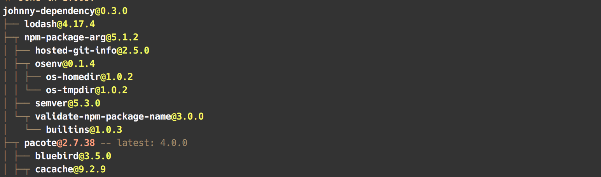

# johhny-dependency

npm -ls for remote packages

## Summary

`johnny-dependency` fetches the dependency tree metadata for a remote npm package.

Additionally `johnny-dependency` fetches information about the latest version of dependency packages
so that you have information about the health of a package's dependency tree
(ie how out of date dependencies are).

## Usage

```js
$ npm install johnny-dependency

// only required for accessing private packages
const pacoteOptions = {
  auth: {
    <NPM_AUTH_TOKEN>,
  },
};

var jd = require('johnny-dependency');

jd('johhny-dependency@latest', pacoteOptions).then((res) => {
  /*
  {
  "name":"johnny-dependency",
  "version":"0.3.0",
  "latestVersion":"0.3.0",
  "children":[
    {
      "name":"lodash",
      "version":"4.17.4",
      "latestVersion":"4.17.4",
      "children":[],
    },
    {
      "name":"rxjs",
      "version":"5.4.2",
      "latestVersion":"5.4.2",
      "children":[
        ...
      ],
    },
    ...
  */
});
```

`johnny-dependency` will prune any circular dependencies in its return data

## CLI

`johnny-dependency` also ships with a cli script that allows you to get info about a remote package from the command-line

```bash
johnny-dependency johnny-dependency@latest
```



## Private Packages

`johnny-dependency` works for private packages as well -
you just need to provide an auth token in the optional `pacoteOptions` argument.
See [usage](#usage) for an example.

If using the cli johnny-dependency will look for a token in `.npmrc` in your home dir.

## Thank you

A big thank you to the following for their help:

- [Jacob Bass](https://github.com/bassjacob)
- [Jonno "Observable" Haines](https://github.com/BarryThePenguin)
- [Alex Frame](https://github.com/alexframe)
